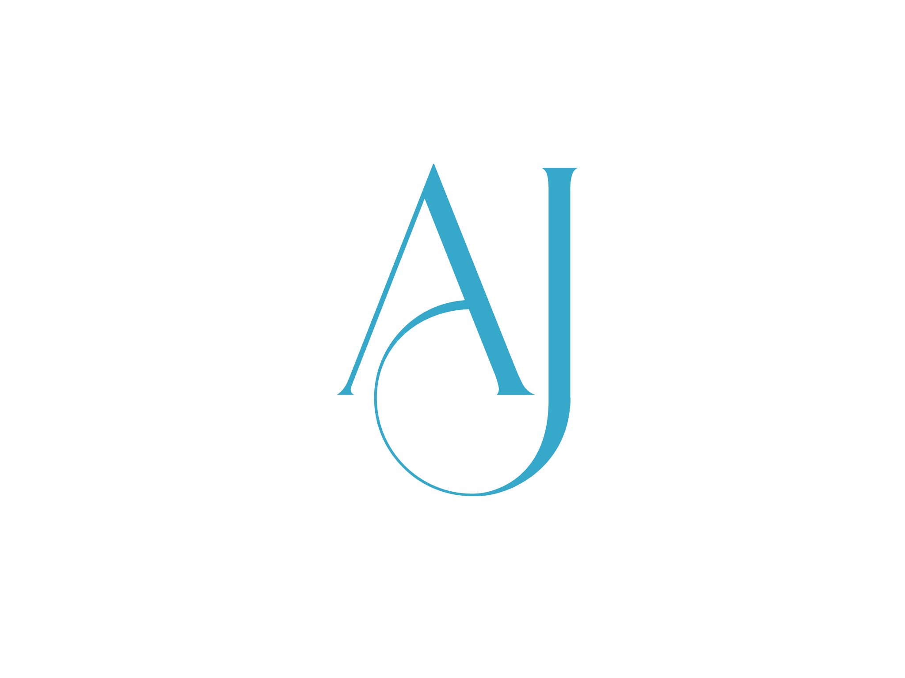

<a name="readme-top"></a>

<div align="center">
  
  <h3 style="color: skyblue">Ajrass Tajemouti</h3>
  <br/>
  <h1><b>MERN App</b></h1>
</div>

# 💗 Table of Contents

- [📚 About the Project](#about-project)
  - [🛠 Built With](#built-with)
    - [Tech Stack](#tech-stack)
    - [Key Features](#key-features)
  - [🚀 Live Demo](#live-demo)
- [💻 Getting Started](#getting-started)
  - [Prerequisites](#prerequisites)
  - [Setup](#setup)
  - [Install](#install)
  - [Usage](#usage)
  - [Run tests](#run-tests)
  - [Deployment](#deployment)
- [👥 Authors](#authors)
- [🛰 Future Features](#future-features)
- [🤝 Contributing](#contributing)
- [⭐ Show your support](#support)
- [🙏 Acknowledgements](#acknowledgements)
- [❓ FAQ (OPTIONAL)](#faq)
- [📝 License](#license)

# 📚 MERN WebApp <a name="about-project"></a>

**MERN WebApp** is a full-stack web application built using the MERN (MongoDB, Express.js, React.js, Node.js) stack. It provides a robust and scalable foundation for developing modern web applications.

## 🛠 Built With <a name="built-with"></a>

### Tech Stack <a name="tech-stack"></a>

<details>
  <summary>Client</summary>
  <ul>
    <li><a href="https://reactjs.org/">React.js(Vite)</a></li>
  </ul>
</details>

<details>
  <summary>Server</summary>
  <ul>
    <li><a href="https://expressjs.com/">Express.js</a></li>
    <li><a href="https://nodejs.org/">Node.js</a></li>
  </ul>
</details>

<details>
  <summary>Database</summary>
  <ul>
    <li><a href="https://www.mongodb.com/">MongoDB</a></li>
  </ul>
</details>

### Key Features <a name="key-features"></a>

- **User Authentication & Authorization**
- **RESTful API with Express.js**
- **Responsive Frontend with React.js(Vite)**
- **State Management with Redux Toolkit**

<p align="right">(<a href="#readme-top">back to top</a>)</p>

## 🚀 Live Demo <a name="live-demo"></a>

- [Live Demo Link](https://www.google.com)

<p align="right">(<a href="#readme-top">back to top</a>)</p>

## 💻 Getting Started <a name="getting-started"></a>

To get a local copy up and running, follow these steps.

### Prerequisites

- Node.js installed
- MongoDB installed and running

### Setup

Clone this repository:

```sh
  git clone https://github.com/tajemouti/mern-app.git
  cd mern-app
```

### Install

Install dependencies:

```sh
  npm install
```

### Usage

To start the development server:

```sh
  npm run dev
```

### Run tests

```sh
  npm test
```

### Deployment

You can deploy this project using:

```sh
  npm run build
```

<p align="right">(<a href="#readme-top">back to top</a>)</p>

## 👥 Authors <a name="authors"></a>

👤 **Ajrass TAJEMOUTI**

- GitHub: [@tajemouti](https://github.com/tajemouti)
- LinkedIn: [ajrass](https://www.linkedin.com/in/ajrass/)
- X: [@AjrassTajemouti](https://x.com/AjrassTajemouti)

<p align="right">(<a href="#readme-top">back to top</a>)</p>

## 🛰 Future Features <a name="future-features"></a>

- [ ] **Real-time chat integration**
- [ ] **Dark mode UI**
- [ ] **Enhanced security features**

<p align="right">(<a href="#readme-top">back to top</a>)</p>

## 🤝 Contributing <a name="contributing"></a>

Contributions, issues, and feature requests are welcome! Feel free to check the [issues page](../../issues/).

<p align="right">(<a href="#readme-top">back to top</a>)</p>

## ⭐ Show your support <a name="support"></a>

If you like this project, please give it a star on GitHub!

<p align="right">(<a href="#readme-top">back to top</a>)</p>

## 🙏 Acknowledgements <a name="acknowledgements"></a>

I would like to thank everyone who contributed to the open-source technologies used in this project.

<p align="right">(<a href="#readme-top">back to top</a>)</p>

## ❓ FAQ (OPTIONAL) <a name="faq"></a>

- **Can I use this project for commercial purposes?**

  - Yes, it is licensed under MIT.

- **Can I contribute to this project?**
  - Absolutely! Feel free to submit a pull request.

<p align="right">(<a href="#readme-top">back to top</a>)</p>

## 📝 License <a name="license"></a>

This project is [MIT](./LICENSE) licensed.

<p align="right">(<a href="#readme-top">back to top</a>)</p>
